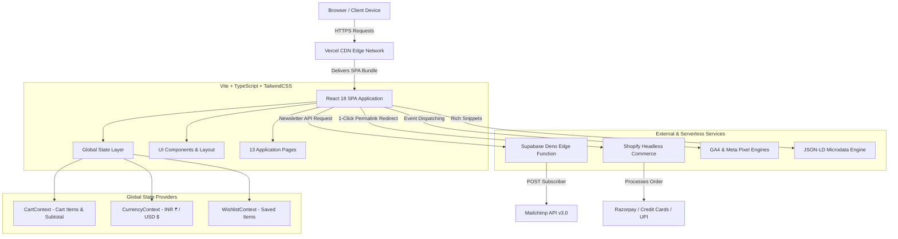
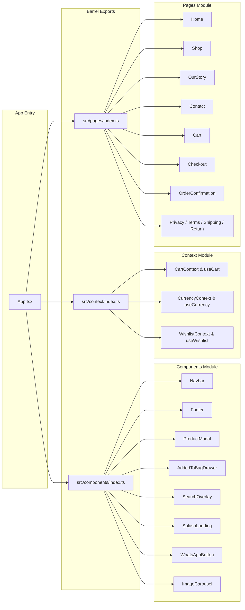
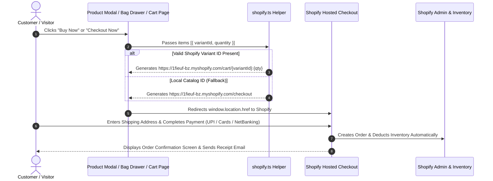
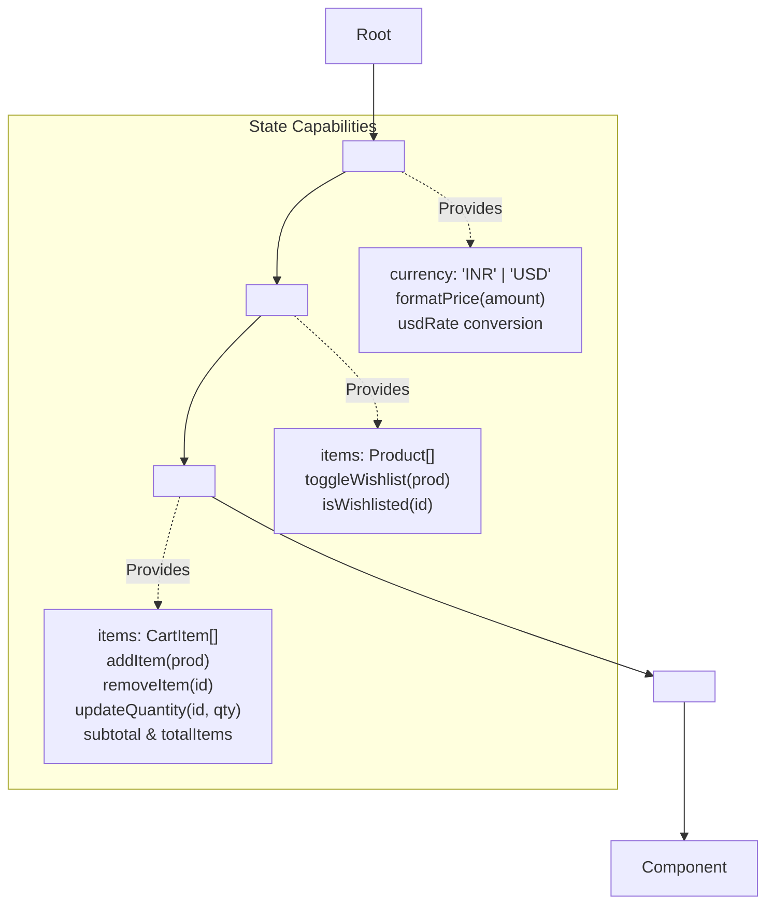
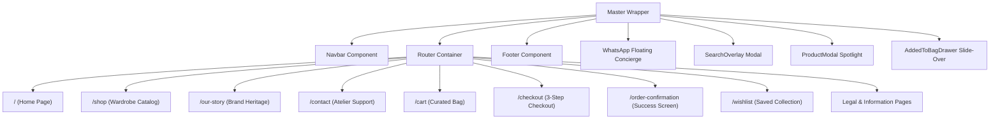

# 👑 Mocha & Mogra — Contemporary Silk Saree E-Commerce Storefront

> **A Collection of Stories, Stitched in Silk.**  
> A high-end, headless React 18 + Vite + TypeScript e-commerce platform crafted with bespoke luxury aesthetics, custom storytelling UI components, headless Shopify commerce integration, Supabase Edge Functions, and enterprise-grade SEO & analytics.

---

## 📋 Table of Contents
1. [Executive Overview & Brand Philosophy](#-executive-overview--brand-philosophy)
2. [System Architecture & Visual Diagrams](#-system-architecture--visual-diagrams)
   - [2.1 High-Level Platform Architecture Flowchart](#21-high-level-platform-architecture-flowchart)
   - [2.2 Modular Barrel Export & Component Dependency Graph](#22-modular-barrel-export--component-dependency-graph)
   - [2.3 User Checkout & Shopify Permalink Sequence Diagram](#23-user-checkout--shopify-permalink-sequence-diagram)
   - [2.4 Global State & Context Provider Hierarchy](#24-global-state--context-provider-hierarchy)
   - [2.5 Page Routing & Component Layout Map](#25-page-routing--component-layout-map)
3. [Complete Codebase Walkthrough & File Inventory](#-complete-codebase-walkthrough--file-inventory)
4. [Key Features & Technical Innovations](#-key-features--technical-innovations)
5. [Setup & Local Development Guide](#-setup--local-development-guide)
6. [E-Commerce & Third-Party Integrations](#-e-commerce--third-party-integrations)
7. [Comprehensive Launch Audit: What is Done vs. What is Left](#-comprehensive-launch-audit-what-is-done-vs-what-is-left)

---

## 🏛️ Executive Overview & Brand Philosophy

**Mocha & Mogra** is a contemporary luxury saree brand celebrating artisan-crafted silk, bespoke motif design, and heritage storytelling. The web application is engineered to evoke the experience of a high-end fashion atelier, combining warm cream and mocha color palettes (`#FAF7F2`, `#FFFEF7`, `#1E140A`), dynamic silk video loops, elegant typography (`Cinzel`, `Playfair Display`, `Lora`), and zero-friction purchase flows.

### Technical Architecture Highlights
- **Headless Commerce Stack**: React 18 SPA built with Vite and TypeScript, paired with Shopify as a headless backend for inventory, order processing, and tax compliance.
- **Modular Barrel Architecture**: Clean, scalable component, page, and context organization powered by TypeScript barrel exports (`index.ts`).
- **Hardware-Accelerated UI Motion**: Smooth page transitions, slide-over drawers, and interactive modals built with `framer-motion` and `lucide-react` icons.
- **Serverless Edge Layer**: Supabase Edge Functions running on Deno for serverless API integrations (Mailchimp newsletter synchronization).
- **Automated Rich Snippet Engine**: Zero-overhead JSON-LD Schema.org microdata injection (`Organization`, `Product`, `ItemList`, `BreadcrumbList`) for rich search engine result snippets.
- **Dual Conversion Tracking**: Unified event dispatching system supporting Google Analytics 4 (GA4) and Meta Pixel (Facebook).

---

## 📐 System Architecture & Visual Diagrams

### 2.1 High-Level Platform Architecture Flowchart



---

### 2.2 Modular Barrel Export & Component Dependency Graph



---

### 2.3 User Checkout & Shopify Permalink Sequence Diagram



---

### 2.4 Global State & Context Provider Hierarchy



---

### 2.5 Page Routing & Component Layout Map



---

## 📁 Complete Codebase Walkthrough & File Inventory

```
Mocha_And_Mogra_Website/
├── .env.example                 # Environment variables template
├── .github/
│   └── workflows/
│       └── supabase-deploy.yml  # Automated deployment workflow for Supabase Edge Functions
├── index.html                   # HTML entry point with CSP headers, SEO meta & Google Fonts
├── package.json                 # Project manifest, dependencies, and build scripts
├── postcss.config.js            # PostCSS configuration for TailwindCSS processing
├── public/                      # Public static assets & brand logos
│   ├── images/
│   │   └── mnmlogo-Photoroom.webp
│   └── favicon.ico
├── README.md                    # Main repository documentation & architectural manual
├── src/
│   ├── App.tsx                  # Master application layout, route definitions & provider tree
│   ├── index.css                # Global design system tokens, typography rules & Tailwind imports
│   ├── main.tsx                 # React 18 DOM mount point with analytics initializer
│   ├── vite-env.d.ts            # Vite TypeScript declarations
│   ├── components/              # Modular UI Component Library
│   │   ├── index.ts             # Central barrel export for all UI components
│   │   ├── AddedToBagDrawer.tsx # Slide-over bag drawer with checkout trigger
│   │   ├── Footer.tsx           # Brand footer with newsletter subscription form
│   │   ├── ImageCarousel.tsx    # Arch-styled media carousel with WebM video support
│   │   ├── Navbar.tsx           # Sticky luxury header with currency toggle & cart badge
│   │   ├── ProductModal.tsx     # Full product detail drawer with story & 1-click Buy Now
│   │   ├── SearchOverlay.tsx    # Modal overlay for real-time catalog search
│   │   ├── SplashLanding.tsx    # Animated opening splash screen
│   │   └── WhatsAppButton.tsx   # Floating concierge WhatsApp CTA button
│   ├── context/                 # React Context Providers for Global State
│   │   ├── index.ts             # Central barrel export for providers and custom hooks
│   │   ├── CartContext.tsx      # Cart item manipulation, quantity updates & subtotal
│   │   ├── CurrencyContext.tsx  # Global currency (INR/USD) & price formatting logic
│   │   └── WishlistContext.tsx  # Persistent wishlist state & toggle handlers
│   ├── data/
│   │   └── products.ts          # Catalog data model & product inventory array
│   ├── lib/                     # Core Utility & Integration Libraries
│   │   ├── analytics.ts         # Dual GA4 & Meta Pixel conversion tracking engine
│   │   ├── jsonld.tsx           # SEO Schema.org structured data helpers
│   │   ├── shopify.ts           # Shopify Headless API & cart permalink generator
│   │   └── supabase.ts          # Supabase client initialization wrapper
│   └── pages/                   # Application Page Views
│       ├── index.ts             # Central barrel export for all application pages
│       ├── Cart.tsx             # Curated shopping cart page with order summary
│       ├── Checkout.tsx         # Standalone 3-step luxury accordion checkout page
│       ├── Contact.tsx          # Brand atelier contact page with validation
│       ├── Home.tsx             # Homepage hero, brand narrative & featured sarees
│       ├── OrderConfirmation.tsx# Post-purchase order success page
│       ├── OurStory.tsx         # Brand heritage & artisanal philosophy page
│       ├── Privacy.tsx          # Privacy policy legal document
│       ├── ReturnPolicy.tsx     # Return & exchange policy legal document
│       ├── ShippingPolicy.tsx   # Domestic & international shipping policy
│       ├── Shop.tsx             # Complete wardrobe catalog with motif & price filters
│       ├── SizeGuide.tsx        # Saree drape & blouse sizing guide
│       ├── Terms.tsx            # Terms of service legal document
│       └── Wishlist.tsx         # Saved items wishlist gallery
├── supabase/
│   ├── config.toml              # Supabase CLI project configuration
│   └── functions/
│       └── subscribe-mailchimp/ # Deno edge function for newsletter sync
│           ├── index.ts
│           └── deno.json
├── tailwind.config.js           # Custom luxury color palette & typography tokens
├── TECHNICAL_DEPENDENCIES_AND_ARCHITECTURE.md # Technical reference manual
├── tsconfig.json                # TypeScript project configuration
├── vercel.json                  # Vercel SPA routing rewrite rules
└── vite.config.ts               # Vite build configuration
```

---

## ✨ Key Features & Technical Innovations

### 1. Luxury Media & Product Discovery
- **Arch-Shaped Media Carousels**: Custom aspect ratio image and WebM video carousels honoring traditional Indian architectural motifs.
- **Multi-Faceted Catalog Filtering**: Filter sarees by category (`Saree` / `Underskirt`), motif themes (Fish, Pineapple, Owl, Elephant, Seahorse), and price ranges.
- **Interactive Search Engine**: Instant keyboard-accessible modal overlay filtering products in real time across titles, motifs, and descriptions.

### 2. Dual Currency Engine (INR ₹ / USD $)
- Global currency switcher in `Navbar` updating prices across all catalog views, product modals, bag drawers, and checkout pages.
- Dynamic complimentary shipping calculation: Complimentary shipping across India for orders above ₹5,000; international threshold dynamically adjusted according to live exchange rates.

### 3. Headless Shopify Integration
- Direct 1-click cart permalinks (`/cart/variant_id:qty`) linking straight into Shopify's checkout engine.
- Fallback checkout mechanism ensuring smooth redirection even when numeric variant IDs are not present.

### 4. Enterprise SEO & Analytics
- Dynamic `JSON-LD` microdata injection (`Organization`, `Product`, `ItemList`, `BreadcrumbList`).
- Dual event dispatching to Google Analytics 4 (`gtag`) and Meta Pixel (`fbq`) for `view_item`, `add_to_cart`, `initiate_checkout`, and `purchase`.

---

## 🛠️ Setup & Local Development Guide

### Prerequisites
- **Node.js**: v18.0.0 or higher
- **npm**: v9.0.0 or higher

### 1. Installation

```bash
git clone https://github.com/Nutricalboii/Mocha_And_Mogra_Website.git
cd Mocha_And_Mogra_Website
npm install
```

### 2. Environment Configuration

Create a `.env` file in the root directory (refer to `.env.example`):

```env
# Shopify Headless Credentials
VITE_SHOPIFY_STORE_DOMAIN=1fieuf-bz.myshopify.com
VITE_SHOPIFY_STOREFRONT_ACCESS_TOKEN=your_storefront_access_token

# Analytics Configuration (Optional for local dev)
VITE_GA4_MEASUREMENT_ID=G-XXXXXXXXXX
VITE_META_PIXEL_ID=1234567890

# Supabase Edge Functions (Optional for local dev)
VITE_SUPABASE_URL=https://your-supabase-project.supabase.co
VITE_SUPABASE_ANON_KEY=your_supabase_anon_key
```

### 3. Available npm Scripts

| Command | Action |
|---|---|
| `npm run dev` | Starts Vite local development server (`http://localhost:5173`) |
| `npm run build` | Builds optimized production bundle in `dist/` |
| `npm run preview` | Previews production build locally |
| `npm run typecheck` | Runs TypeScript type checking without emitting files |

---

## 🔌 E-Commerce & Third-Party Integrations

### 1. Headless Shopify Direct Checkout
The application utilizes Shopify's **Cart Permalink Format**. When a customer clicks **"Buy Now"** or **"Checkout Now"**, the helper in `src/lib/shopify.ts` constructs a direct URL:

```typescript
// Example constructed URL for real variant IDs:
https://1fieuf-bz.myshopify.com/cart/4567890123:1,4567890124:2

// Fallback URL for catalog items:
https://1fieuf-bz.myshopify.com/checkout
```

This bypasses custom payment gateway maintenance on the React side while retaining 100% of Shopify's native checkout capabilities (PCI compliance, Razorpay/Stripe, UPI, credit cards, automated order receipts).

### 2. Supabase + Mailchimp Newsletter Subsystem
Newsletter subscriptions submitted in `Footer.tsx` trigger the Supabase Edge Function located at `supabase/functions/subscribe-mailchimp/index.ts`:
1. Verifies CORS preflight headers (`OPTIONS`).
2. Inserts the subscriber email into Supabase table `newsletter_subscribers`.
3. Sends an authenticated `POST` request to Mailchimp API v3.0 (`https://{DC}.api.mailchimp.com/3.0/lists/{LIST_ID}/members`).

---

## 🎯 Comprehensive Launch Audit: What is Done vs. What is Left

| Component / Subsystem | Status | Details / Description | Action Required for Production |
|---|---|---|---|
| **Frontend UI & Styling** | ✅ **100% Complete** | Bespoke luxury aesthetic, warm cream/mocha palette, silk video loops, custom typography. | None. Fully verified. |
| **Catalog & Product Modal** | ✅ **100% Complete** | Arch carousels, motif filters, story drawers, 1-click Buy Now. | Optional: Replace Cloudinary demo URLs with brand CDN if needed. |
| **State Management** | ✅ **100% Complete** | Cart, Wishlist, and Currency Contexts with localStorage persistence. | None. Fully verified. |
| **Modular Barrel Architecture** | ✅ **100% Complete** | Clean `index.ts` barrel exports for components, contexts, and pages. | None. Fully verified. |
| **Shopify Integration** | ✅ **100% Complete** | Permalink checkout redirect helper & fallback mechanism implemented. | **Add real Shopify numeric Variant IDs** in `src/data/products.ts` for 1-click line item cart loading. |
| **Shopify Admin Setup** | 🟡 **Pending Client Action** | Shopify store created (`1fieuf-bz.myshopify.com`). | **Disable password protection** in Shopify Admin -> Preferences, and **enable payment gateway** (Razorpay / Stripe). |
| **Custom Domain Setup** | 🟡 **Pending Client Action** | Code ready for custom domain deployment. | Purchase domain (e.g. `mochanmogra.com`) and configure DNS records in Vercel & Shopify. |
| **Supabase Edge Function** | ✅ **100% Complete** | Deno function & GitHub Action workflow deployed. | Set Supabase secrets (`MAILCHIMP_API_KEY`, `MAILCHIMP_LIST_ID`, `MAILCHIMP_DC`) via CLI or dashboard. |
| **SEO & Structured Data** | ✅ **100% Complete** | Dynamic JSON-LD injection (Product, Org, ItemList, Breadcrumbs). | Replace `BASE_URL` in `src/lib/jsonld.tsx` with official production domain once live. |
| **Analytics Engine** | ✅ **100% Complete** | Dual GA4 & Meta Pixel tracking setup with safety guards. | Add production `VITE_GA4_MEASUREMENT_ID` and `VITE_META_PIXEL_ID` in Vercel environment settings. |
| **GitHub Deployment (PR #7)** | ✅ **100% Complete** | PR #7 submitted on upstream repository (`Anushka130126/Mocha_And_Mogra_Website`). | **Merge PR #7** on GitHub to trigger automatic Vercel production deployment. |

---

*Documentation maintained by Antigravity AI Engineering Team for Mocha & Mogra.*
