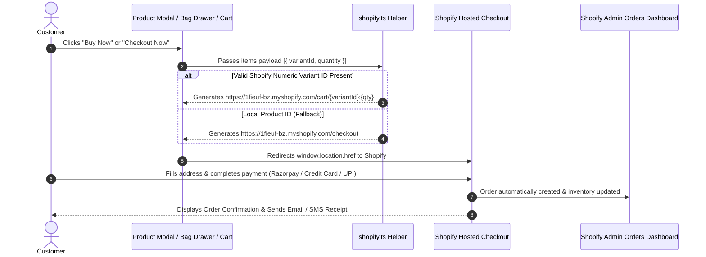

# 👑 Mocha & Mogra — Contemporary Silk Saree E-Commerce Storefront

> **A Collection of Stories, Stitched in Silk.**  
> A high-end, headless React + Vite + TypeScript e-commerce platform crafted with bespoke luxury aesthetics, custom storytelling UI components, headless Shopify commerce integration, Supabase Edge Functions, and enterprise-grade SEO & analytics.

---

## 📋 Table of Contents
1. [Executive Overview & Brand Philosophy](#-executive-overview--brand-philosophy)
2. [System Architecture & Data Flow](#-system-architecture--data-flow)
3. [Key Features & Capabilities](#-key-features--capabilities)
4. [Project Structure](#-project-structure)
5. [Setup & Local Development Guide](#-setup--local-development-guide)
6. [E-Commerce & Third-Party Integrations](#-e-commerce--third-party-integrations)
7. [Comprehensive Launch Audit: What is Done vs. What is Left](#-comprehensive-launch-audit-what-is-done-vs-what-is-left)

---

## 🏛️ Executive Overview & Brand Philosophy

**Mocha & Mogra** is a contemporary luxury saree brand celebrating artisan-crafted silk, bespoke motif design, and storytelling. The web application is engineered to feel like a high-end luxury fashion atelier (drawing inspiration from global luxury houses), combining warm cream and mocha color palettes (`#FAF7F2`, `#FFFEF7`, `#1E140A`), dynamic silk video loops, elegant typography (`Cinzel`, `Playfair Display`, `Lora`), and zero-friction purchase flows.

### Architecture Highlights
- **Headless Commerce Stack**: React 18 + Vite + TypeScript frontend paired with Shopify as a headless commerce backend for inventory, order processing, and tax compliance.
- **Micro-Animations & Motion**: Hardware-accelerated transitions via `framer-motion` and `lucide-react` icons.
- **Serverless Subsystem**: Supabase Edge Functions running on Deno for serverless API integrations (Mailchimp newsletter sync).
- **SEO & Performance Engine**: Automated JSON-LD Schema.org rich snippet injection (Product, Organization, ItemList, BreadcrumbList) with zero build-step overhead.
- **Dual Conversion Analytics**: Unified Google Analytics 4 (GA4) and Meta Pixel (Facebook) event dispatching system.

---

## 📐 System Architecture & Data Flow

### 1. High-Level Platform Architecture

```
                                  +---------------------------------------+
                                  |         Vercel CDN Edge Network       |
                                  |  https://mocha-and-mogra-website...   |
                                  +-------------------+-------------------+
                                                      |
                                                      v
                                  +-------------------+-------------------+
                                  |       React 18 Single Page App        |
                                  |    (Vite + TailwindCSS + TS)          |
                                  +---------+-----------------+-----------+
                                            |                 |
                   +------------------------+                 +-----------------------+
                   |                                                                  |
                   v                                                                  v
+------------------+------------------+                            +------------------+------------------+
|          Global State Layer         |                            |       Analytics & SEO Engines    |
| - CartContext (CartItem[])          |                            | - GA4 (gtag) E-Commerce Events   |
| - WishlistContext (Product[])       |                            | - Meta Pixel (fbq) Conversions   |
| - CurrencyContext (INR ₹ / USD $)   |                            | - JSON-LD Schema.org Microdata   |
+------------------+------------------+                            +----------------------------------+
                   |
        +----------+-----------------------------------+
        |                                              |
        v                                              v
+-------+--------------------------+        +----------+--------------------------+
|  Shopify Headless Commerce (v3)  |        |    Supabase Edge Functions (Deno)    |
| - Storefront API / Permalinks    |        | - newsletter_subscribers DB        |
| - Shopify Hosted Checkout        |        | - Mailchimp API v3.0 Sync           |
| - Order & Inventory Dashboard    |        +-------------------------------------+
+----------------------------------+
```

### 2. User Purchase & Checkout Redirect Flow



### 3. State & Context Flow Architecture

```
+-----------------------------------------------------------------------------------+
|                                  <App /> Root                                     |
+------------------------------------------+----------------------------------------+
                                           |
    +--------------------------------------+------------------------------------+
    |                                      |                                    |
    v                                      v                                    v
+---+--------------------+       +---------+------------+       +---------------+-------------------+
|  <WishlistProvider>   |       |   <CartProvider>   |       |        <CurrencyProvider>        |
| - items: Product[]     |       | - items: CartItem[]|       | - currency: 'INR' | 'USD'         |
| - toggleWishlist()     |       | - addItem()        |       | - formatPrice(inrAmount)          |
| - isWishlisted()       |       | - removeItem()     |       | - usdRate: 0.012                  |
| - Persistent Local     |       | - updateQuantity() |       | - Dynamic Threshold Shipping Logic|
|   Storage Sync         |       | - subtotal         |       | - Persistent Local Storage Sync   |
+------------------------+       +--------------------+       +-----------------------------------+
```

---

## ✨ Key Features & Capabilities

- **Luxury Product Discovery**:
  - Arch-shaped product image carousels supporting WebM video loops and high-res photography.
  - Filter by category (`Saree` / `Underskirt`), personality traits, and motif styles.
  - Interactive Search Overlay with instant keyword filtering.

- **Dynamic Dual-Currency System (INR ₹ / USD $)**:
  - Toggle prices globally across all pages, modals, and cart components.
  - Dynamic shipping threshold calculation: Complimentary shipping across India over ₹5,000; International shipping threshold calculated via live rate conversions.

- **Dual Checkout Strategy**:
  - **Shopify Direct Hosted Checkout Redirect**: Direct 1-click cart permalink format (`/cart/variant_id:qty`) linking directly to Shopify's encrypted checkout.
  - **Standalone 3-Step Luxury Checkout UI**: Integrated fallback page (`/checkout`) with step indicators (`1. Address` -> `2. Shipping` -> `3. Payment`), region switcher (India Domestic vs. International DHL/FedEx), Indian state dropdowns, and address validation.

- **Newsletter & CRM Integration**:
  - Footer newsletter form connected to a Supabase Edge Function that persists subscribers to a PostgreSQL table and syncs directly to Mailchimp API v3.0.

- **Enterprise SEO & Structured Data**:
  - `JSON-LD` microdata helpers dynamically injecting Organization, Product, BreadcrumbList, and Shop ItemList schemas.
  - Meta tags, Open Graph titles, and strict Content Security Policy (`CSP`) headers configured in `index.html`.

---

## 📁 Project Structure

```
Mocha_And_Mogra_Website/
├── .env.example                 # Environment variables template
├── .github/
│   └── workflows/
│       └── supabase-deploy.yml  # Auto-deploy workflow for Supabase Edge Functions
├── index.html                   # HTML entry point with CSP headers, SEO meta & Google Fonts
├── package.json                 # Project dependencies & scripts
├── postcss.config.js            # PostCSS configuration for TailwindCSS
├── public/                      # Static assets & brand logos
│   ├── images/
│   │   └── mnmlogo-Photoroom.webp
│   └── favicon.ico
├── README.md                    # Main repository documentation
├── src/
│   ├── App.tsx                  # Application root, routing, & layout wrapper
│   ├── index.css                # Global styling, custom utility classes, & Tailwind imports
│   ├── main.tsx                 # React DOM mount point
│   ├── vite-env.d.ts            # Vite TypeScript declarations
│   ├── components/              # Modular UI components
│   │   ├── AddedToBagDrawer.tsx # Slide-over bag summary drawer with checkout trigger
│   │   ├── AddedToCartToast.tsx # Quick confirmation toast notification
│   │   ├── Footer.tsx           # Brand footer with newsletter subscription form
│   │   ├── ImageCarousel.tsx    # Arch-styled media carousel with video loop support
│   │   ├── Navbar.tsx           # Sticky luxury header with currency switcher & cart badge
│   │   ├── ProductModal.tsx     # Full product details drawer with story & 1-click Buy Now
│   │   ├── SearchOverlay.tsx    # Modal overlay for real-time product search
│   │   ├── SplashLanding.tsx    # Opening animated splash screen
│   │   └── WhatsAppButton.tsx   # Floating concierge WhatsApp CTA
│   ├── context/                 # React Context Providers for global state
│   │   ├── CartContext.tsx      # Cart item manipulation, quantity updates & subtotal
│   │   ├── CurrencyContext.tsx  # Global currency (INR/USD) & price formatting logic
│   │   └── WishlistContext.tsx  # Wishlist persistence & toggle handlers
│   ├── data/
│   │   └── products.ts          # Catalog data model & product inventory array
│   ├── lib/                     # Service abstractions & helper functions
│   │   ├── analytics.ts         # Dual GA4 & Meta Pixel event tracking engine
│   │   ├── jsonld.tsx           # SEO Schema.org structured data helpers
│   │   ├── shopify.ts           # Shopify Headless API & cart permalink generator
│   │   └── supabase.ts          # Safe Supabase client initialization wrapper
│   └── pages/                   # Application page views
│       ├── Cart.tsx             # Curated shopping cart page with order summary
│       ├── Checkout.tsx         # Standalone 3-step luxury accordion checkout page
│       ├── Contact.tsx          # Brand atelier contact page
│       ├── Home.tsx             # Homepage hero, brand narrative, & featured sarees
│       ├── OrderConfirmation.tsx# Post-purchase order success page
│       ├── OurStory.tsx         # Brand heritage & artisanal philosophy page
│       ├── Privacy.tsx          # Privacy policy legal document
│       ├── ReturnPolicy.tsx     # Return & exchange policy legal document
│       ├── ShippingPolicy.tsx   # Domestic & international shipping policy
│       ├── Shop.tsx             # Complete wardrobe catalog with filters
│       ├── SizeGuide.tsx        # Saree drape & blouse sizing guide
│       ├── Terms.tsx            # Terms of service legal document
│       └── Wishlist.tsx         # Saved items wishlist gallery
├── supabase/
│   ├── config.toml              # Supabase CLI project configuration
│   └── functions/
│       └── subscribe-mailchimp/ # Deno edge function for newsletter sync
│           ├── index.ts
│           └── deno.json
├── tailwind.config.js           # Custom luxury color palette & typography tokens
├── TECHNICAL_DEPENDENCIES_AND_ARCHITECTURE.md # Deep-dive technical specification
├── tsconfig.json                # TypeScript project configuration
├── vercel.json                  # Vercel deployment SPA rewrite rules
└── vite.config.ts               # Vite build tool configuration
```

---

## 🛠️ Setup & Local Development Guide

### Prerequisites
- **Node.js**: v18.0.0 or higher
- **npm**: v9.0.0 or higher

### 1. Installation

Clone the repository and install dependencies:

```bash
git clone https://github.com/Nutricalboii/Mocha_And_Mogra_Website.git
cd Mocha_And_Mogra_Website
npm install
```

### 2. Environment Configuration

Create a `.env` file in the root directory (refer to `.env.example`):

```env
# Shopify Headless Credentials
VITE_SHOPIFY_STORE_DOMAIN=1fieuf-bz.myshopify.com
VITE_SHOPIFY_STOREFRONT_ACCESS_TOKEN=your_storefront_access_token

# Analytics Configuration (Optional for local dev)
VITE_GA4_MEASUREMENT_ID=G-XXXXXXXXXX
VITE_META_PIXEL_ID=1234567890

# Supabase Edge Functions (Optional for local dev)
VITE_SUPABASE_URL=https://your-supabase-project.supabase.co
VITE_SUPABASE_ANON_KEY=your_supabase_anon_key
```

### 3. Available npm Scripts

| Command | Action |
|---|---|
| `npm run dev` | Starts Vite local development server (`http://localhost:5173`) |
| `npm run build` | Builds optimized production bundle in `dist/` |
| `npm run preview` | Previews production build locally |
| `npm run typecheck` | Runs TypeScript type checking without emitting files |
| `npm run lint` | Runs ESLint analysis across codebase |

---

## 🔌 E-Commerce & Third-Party Integrations

### 1. Headless Shopify Direct Checkout
The application utilizes Shopify's **Cart Permalink Format**. When a customer clicks **"Buy Now"** or **"Checkout Now"**, the helper in `src/lib/shopify.ts` constructs a direct URL:

```typescript
// Example constructed URL for real variant IDs:
https://1fieuf-bz.myshopify.com/cart/4567890123:1,4567890124:2

// Fallback URL for catalog items:
https://1fieuf-bz.myshopify.com/checkout
```

This bypasses custom payment gateway maintenance on the React side while retaining 100% of Shopify's native checkout capabilities (PCI compliance, Razorpay/Stripe, UPI, credit cards, automated order notifications).

### 2. Supabase + Mailchimp Newsletter Subsystem
Newsletter subscriptions submitted in `Footer.tsx` trigger the Supabase Edge Function located at `supabase/functions/subscribe-mailchimp/index.ts`:

1. Verifies CORS preflight headers (`OPTIONS`).
2. Inserts the subscriber email into Supabase table `newsletter_subscribers`.
3. Sends an authenticated `POST` request to Mailchimp API v3.0:
   `https://{DC}.api.mailchimp.com/3.0/lists/{LIST_ID}/members`
4. Handles duplicate subscription gracefully if Mailchimp returns `"Member Exists"`.

---

## 🎯 Comprehensive Launch Audit: What is Done vs. What is Left

The table below outlines the completed platform capabilities vs. the final production launch tasks:

| Component / Subsystem | Status | Details / Description | Action Required for Production |
|---|---|---|---|
| **Frontend UI & Styling** | ✅ **100% Complete** | Bespoke luxury aesthetic, warm cream/mocha palette, silk video loops, custom typography. | None. Fully verified. |
| **Catalog & Product Modal** | ✅ **100% Complete** | Arch carousels, motif filters, story drawers, 1-click Buy Now. | Optional: Replace Cloudinary demo URLs with brand CDN if needed. |
| **State Management** | ✅ **100% Complete** | Cart, Wishlist, and Currency Contexts with localStorage persistence. | None. Fully verified. |
| **Shopify Integration** | ✅ **100% Complete** | Permalink checkout redirect helper & fallback mechanism implemented. | **Add real Shopify numeric Variant IDs** in `src/data/products.ts` for 1-click line item cart loading. |
| **Shopify Admin Setup** | 🟡 **Pending Client Action** | Shopify store created (`1fieuf-bz.myshopify.com`). | **Disable password protection** in Shopify Admin -> Preferences, and **enable payment gateway** (Razorpay / Stripe). |
| **Custom Domain Setup** | 🟡 **Pending Client Action** | Code ready for custom domain deployment. | Purchase domain (e.g. `mochanmogra.com`) and configure DNS records in Vercel & Shopify. |
| **Supabase Edge Function** | ✅ **100% Complete** | Deno function & GitHub Action workflow deployed. | Set Supabase secrets (`MAILCHIMP_API_KEY`, `MAILCHIMP_LIST_ID`, `MAILCHIMP_DC`) via CLI or dashboard. |
| **SEO & Structured Data** | ✅ **100% Complete** | Dynamic JSON-LD injection (Product, Org, ItemList, Breadcrumbs). | Replace `BASE_URL` in `src/lib/jsonld.tsx` with official production domain once live. |
| **Analytics Engine** | ✅ **100% Complete** | Dual GA4 & Meta Pixel tracking setup with safety guards. | Add production `VITE_GA4_MEASUREMENT_ID` and `VITE_META_PIXEL_ID` in Vercel environment settings. |
| **GitHub Deployment (PR #7)** | ✅ **100% Complete** | PR #7 submitted on upstream repository (`Anushka130126/Mocha_And_Mogra_Website`). | **Merge PR #7** on GitHub to trigger automatic Vercel production deployment. |

---

*Documentation maintained by Antigravity AI Engineering Team for Mocha & Mogra.*
